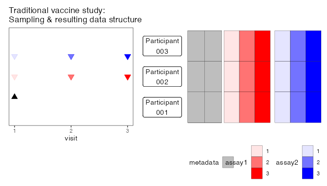
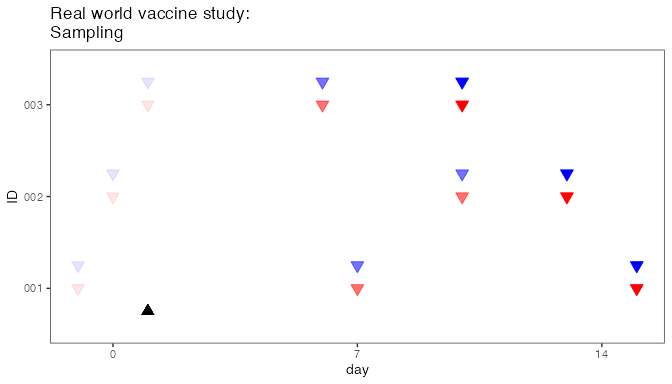
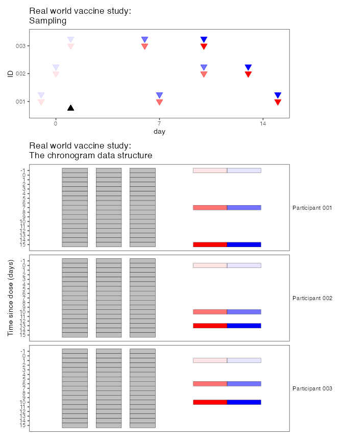
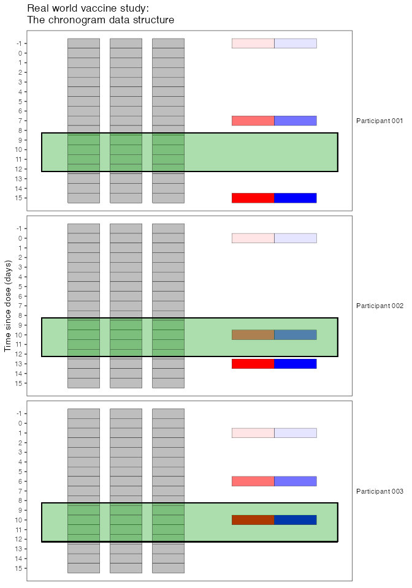
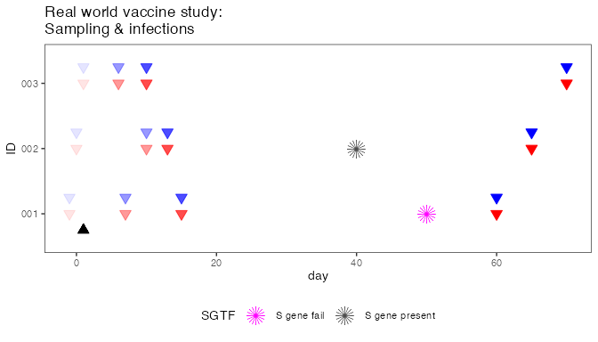
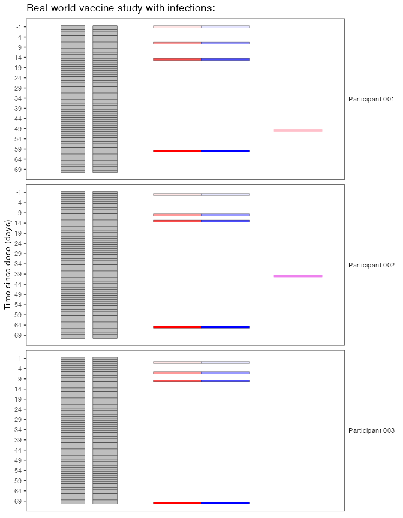
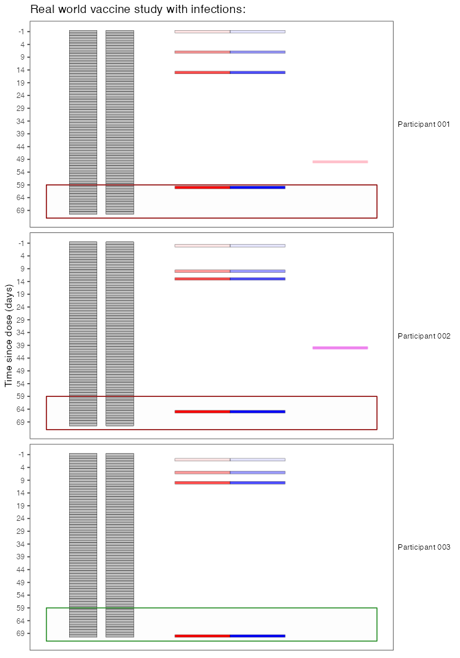

<!-- README.md is generated from README.Rmd. Please edit that file -->

# chronogram

<!-- badges: start -->

[](https://lifecycle.r-lib.org/articles/stages.html#stable)
[](https://github.com/FrancisCrickInstitute/chronogram/actions/workflows/R-CMD-check.yaml)
<!-- badges: end -->

The goal of chronogram is to “cast” and annotate metadata, laboratory
and clinical data into a tidy-like data structure. This bridges between
a LIMS / database style data warehouse and data that is ready for
interrogation to test biological hypotheses.

Chronogram was designed during the SARS-CoV-2 pandemic (2019-). However,
it is pathogen, vaccine and symptoms agnostic. It can be adapted for any
pathogen, studies that have several pathogens/vaccines combinations.

Chronogram uses tidyverse approaches for several reasons:

- the final aim is often `ggplot2`

- many `tidyverse` verbs are immediately useful on a chronogram object.

- the wider `R/tidyverse/quarto/reproducible science` ecosystem tools
  offer valuable ways to extend.

- within our teams, scientist and clinicians with some coding experience
  frequently target `R/tidyverse`

## Installation

You can install the development version of chronogram from
[GitHub](https://github.com/) with:

``` r
## 1. Setup R and git ####
# install.packages("usethis")
# install.packages("credentials")

# Replace:
## - XXXX with your github username
## - YYYY@ZZZZ with the email address you use for github
usethis::use_git_config(user.name = "XXXX", user.email = "YYYY@ZZZZ")
 
# Go to github page to generate token
usethis::create_github_token()
 
# paste your PAT into pop-up that follows...
credentials::set_github_pat()

## ^ above only needs running once for R and git to interact

## 2. Install package itself ####

# install.packages("devtools")
devtools::install_github("FrancisCrickInstitute/chronogram")
```

## The problem

Immunology studies of vaccine responses are traditionally designed as
follows:

- matched cohort vaccinated on the same day
- return visits on the same subsequent day
- assays performed on samples from matched visit days

This study design is shown below (left). There is a single vaccine dose
(d0) and 3 visits: baseline and 2 follow-up visits at d7 and d14. The
resulting data can be compiled into a simple data structure (below,
right): individuals are rows, there are a few columns of metadata (age,
sex, etc) and then the two assays are reported as columns: assay 1
{visit 1, visit 2, visit 3}; assay 2 {visit 1, visit 2, visit 3}.



In observational cohort studies, particularly in pandemic settings, this
is inadequate for immunology studies conducted pragmatically, where
vaccine dates, available samples, and dates of additional doses can (and
will!) change. An example real-world study is shown here:



Many studies will have massive datasets, stored as an SQL database or
equivalent LIMS solutions. These are great ways to store and maintain
source data, but do not allow the user - particularly a biologist - to
“place” the results in their full immunological context: that
participant’s prior exposures to vaccines and infections. This is the
problem the chronogram package solves.

## The solution

A chronogram is a hidden date often within an inscription, for example
on a headstone, and often with Roman numerals doubling as Roman
characters. We adopted the name for this package, as it helps to find
the hidden immunological meaning with dates.

Below is a sketch of a real-world study after a single vaccine dose
(top). Now, we have arranged the resulting data in a chronogram format
(bottom), where data is structured in a ‘long format’ with each row
presented a specific date for an individual. Metadata (grey) is repeated
on each row. The experimental data are only stored against the relevant
date of sampling.



Chronogram’s date-centric design allows users to integrate and
interrogate data, which would otherwise be hidden (or at least hard to
find) in traditional formats. For example, if you were examining
responses to vaccines 9-12d after the dose, the traditional model would
indiscriminately say “visit 3 is closest, use that set”. In contrast,
chronogram allows a relevant slice of the data (green box) to be taken
rapidly, with the date of dose stored in the metadata columns (grey).

``` r
slice.of.data <- chrono %>%
  filter(calendar_date > date_dose_1 + 9) %>%
  filter(calendar_date < date_dose_1 + 12)
```



## The real world solution

Because it is date-aware, chronogram also allows the user to assemble
any date-varying data: - dates of positive PCR results (or dates of
negative PCRs from occupational screening); - S gene target failure (or
presence); - viral sequencing results; symptoms; - additional doses

To illustrate, let’s add some infections to our example study. An
observational study will never have same-day infections across the
cohort, so in the real world infection data always requires this kind of
approach.

Now participant 001 has a positive PCR at day 50, with S gene target
failure, and participant 002 has a positive PCR at day 40 with S gene
presence.



And here is the same data cast into chronogram structure



Our biological question in this example is how waning from first
vaccination proceeds over 2 months. For 001 and 002, their last visit is
unhelpful, as they have had a boost from additional encounter with
antigen (an infection). Here we can slice something like this:

``` r
## get a list of unhelpful participants ##
unhelpful.participants <- chrono %>%
  group_by(ID) %>%
  filter(stringr::str_detect(PCR, "pos"))

## make the selection ##
slice.of.data <- chrono %>%
  ## filter ##
  filter(!ID %in% unhelpful.participants) %>%
  ## window ##
  filter(calendar_date > date_dose_1 + 60)
```

This keeps 003’s data (green box), and ignores 001 and 002’s data (red
boxes).



`Chronogram` contains a suite of functions to annotate chronograms,
which we recommend running immediately after assembly. These annotations
include the number of doses, and number of infections, so it is even
more straightforward to select, for example:

``` r
annotated.chrono %>%
  filter(number_of_infections == 0)
```

The annotation function `cg_annotate_episodes_find()` searches for a
user-specified number of days earlier (and later), to gather symptoms,
tests, sequencing that might occur on different days but are really a
single episode of infection. `cg_annotate_episodes_count()` converts
this into a count.

Check out the vignettes for more info.

Many of the examples use a SARS-CoV-2-like scenario of testing, vaccines
etc, however you could use chronogram to manage any kind of vaccine
response (+exposure) data for any pathogen(s).
