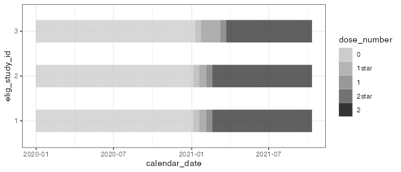
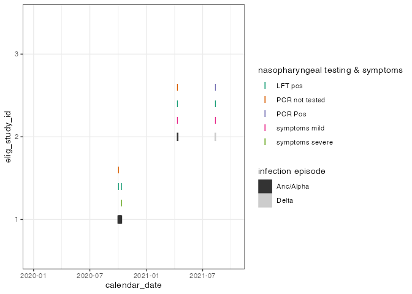
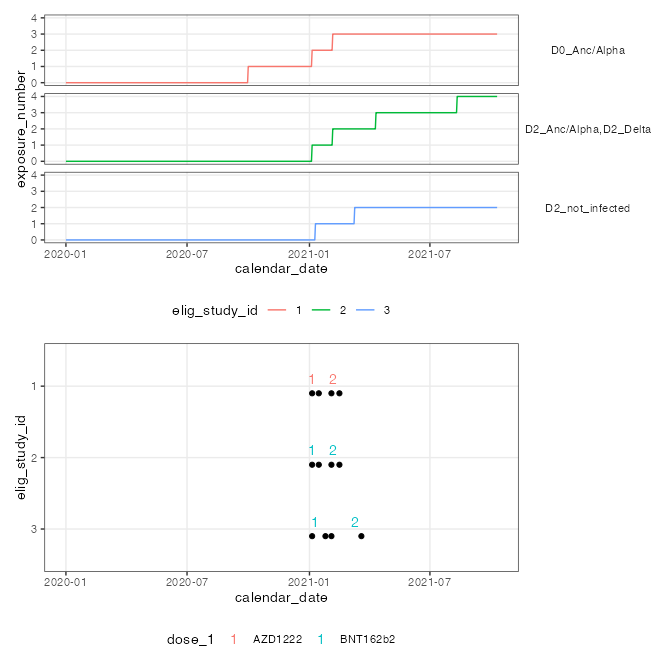

<!-- README.md is generated from README.Rmd. Please edit that file -->

# chronogram

<!-- badges: start -->

[](https://lifecycle.r-lib.org/articles/stages.html#stable)
[](https://github.com/FrancisCrickInstitute/chronogram/actions/workflows/R-CMD-check.yaml)

<!-- badges: end -->

The goal of `chronogram` is to “cast” and annotate metadata, laboratory
and clinical data into a tidy-like data structure. This bridges between
a LIMS / database style data warehouse and data that is ready for
interrogation to test biological hypotheses.

`chronogram` was designed during the SARS-CoV-2 pandemic (2019-).
However, it is pathogen, vaccine and symptoms agnostic.

------------------------------------------------------------------------

## Installation

Install the current version from [GitHub](https://github.com/):

``` r
# install.packages("devtools")
devtools::install_github("FrancisCrickInstitute/chronogram")
```

If you have not installed packages from github before, you will need to
[setup your GitHub account to interact with
R](https://usethis.r-lib.org/articles/git-credentials.html#practical-instructions).

------------------------------------------------------------------------

## Why should I use `chronogram`?

- To aggregate study data **regularly 🕓**, and **repetitively 🔁**.
  Perhaps your study has rolling recruitment, ongoing data generation or
  incremental analysis. Outsource that effort to `chronogram`.

- To **reproducibly aggregate** data within and **across several
  studies** & **users 👩‍💻👨‍💻**. Stop troubleshooting joins by hand.

- To provide a **versatile** data shape **poised** for **new or
  follow-up analyses** without needing re-aggregation 🛫.

***When shouldn’t I use `chronogram`?***

Your study is **completed**. You have assembled a clean, de-duplicated
and fully annotated data object. You have **finished all data
analysis**. Congratulations! 🥳 Don’t reinvent the wheel here.

------------------------------------------------------------------------

## How do I use `chronogram`?

The `chronogram` workflow can be divided into assembly, annotation and
finally, filtering, windowing and selecting data for a specific
analysis.

### chronogram assembly

- `cg_assemble()` combines cleaned metadata, experimental data, and a
  range of calendar dates into a chronogram.

- `cg_add_experiment()` allows the adding of further experiments.

Further details:

- [assembly](articles/assembly.html) vignette for a step-by-step guide,
  or the [quickstart](articles/chronogram.html).

- [SQL vignette](articles/SQL_assembly.html) explains `chronogram`
  assembly from an SQL database.

- An introduction to the [chronogram
  class](articles/chronogram_class.html).

### chronogram annotation

#### Annotate vaccines



Label each day for each participant with the number of doses they have
received, including support for a lag period between the reciept of a
dose and its immunological priming effect. [Annotate vaccines
here](articles/annotate_vaccines.html).

#### Annotate infection episodes



Symptoms, point-of-care tests, and laboratory tests of infection rarely
occur on exactly the same study day. `chronogram` finds, fills and
annotates these tests and symptoms into episodes of infection. [Annotate
episodes here](articles/annotate_episodes.html).

#### Annnotate exposures



After annotating vaccines and infection episodes, these can be combined
to [annotate exposures](articles/annotate_exposures.html) - encounters
with antigen from either infection or vaccination.

------------------------------------------------------------------------

### chronogram filtering, window and select

- `dplyr::filter()` to filter a chronogram based on metadata (eg vaccine
  formulation)

- `cg_window_by_metadata()` to window around an event such as 14 days
  after each participant’s vaccine

- `cg_window_by_episode()` picks a window around infection episodes

See these functions at work in our [brief primer](articles/stats.html)
demonstrating how to a pass `chronogram` to a variety of statistical
tests.

------------------------------------------------------------------------
